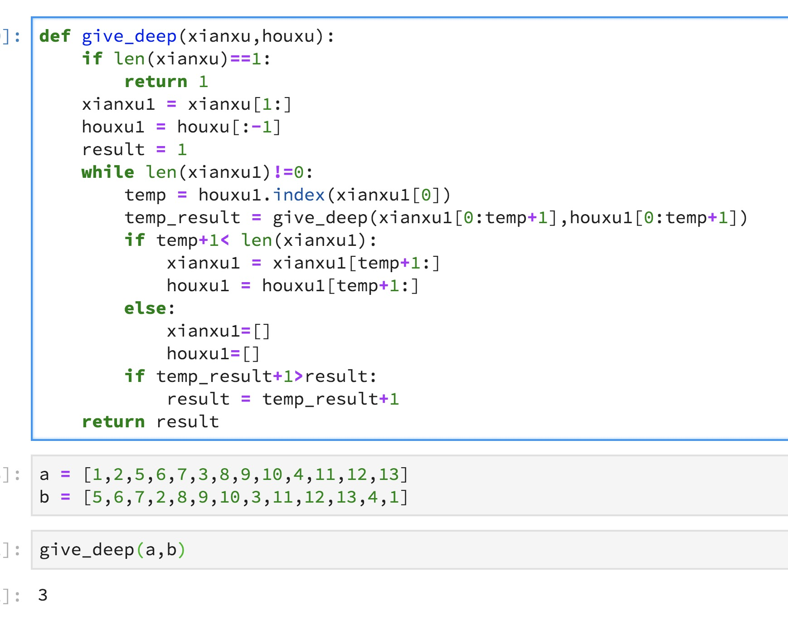

## 不知道咋分类的数据结构和不知道咋分类的算法

### n个数最*小*的前k个

#### 法一：变种快排
随机选定一个pivot，那么数组中有$S_1,S_2$分别代表比pivot小和大的两个子数组。

如果k <= |S1|，那么第k个最元素必然在S1中。在这种情况下，返回QuickSelect(S1, k)。

如果k = 1 + |S1|，那么枢纽元素就是第k个最小元素，即找到，直接返回它。

否则(k>1+S1)，这第k个最小元素就在S2中，即S2中的第$（k - |S1| - 1）$个最小元素，我们递归调用并返回QuickSelect(S2, k - |S1| - 1)。
```C++
//QuickSelect 将第k小的元素放在 a[k-1]  
void QuickSelect( int a[], int k, int left, int right )
{
   int i, j;
   int pivot;

   if( left + cutoff <= right )
   {
       pivot = median3( a, left, right );
       //取三数中值作为枢纽元，可以很大程度上避免最坏情况
       i = left; j = right - 1;
       for( ; ; )
       {
           while( a[ ++i ] < pivot ){ }
           while( a[ --j ] > pivot ){ }
           if( i < j )
               swap( &a[ i ], &a[ j ] );
           else
               break;
       }
       //重置枢纽元
       swap( &a[ i ], &a[ right - 1 ] );  

       if( k <= i )
           QuickSelect( a, k, left, i - 1 );
       else if( k > i + 1 )
           QuickSelect( a, k, i + 1, right );
   }
   else  
       InsertSort( a + left, right - left + 1 );
}
```
#### 法二：变种堆排
维持一个大小为k的最*大*堆，根据新来的数据，若大于根节点，则不操作
若小于根节点，则将根节点删除，并替换为新来的数据，继续维护最大堆的性质。

#### 法三：暴力
若所有都为正整数，并给出范围为\[0,m\]，则开一个m+1大小的数组，含义为$a[k]$ 数字k出现的次数，
直接根据k的个数累加找就行了

### 表达式求解
#### 使用堆栈（太难了之后写)

### 优先队列求解huffman树
* huffman树：每次都是最小的两个节点组成到一起
* priority_queue：`#include<queue>` 优先队列

## 树

### 二叉树的中、前、后序遍历

#### 说明Ω
* 前：根左右
* 中：左根右
* 后：左右根
#### 递归写法
很好写，不说了
#### 非递归写法
太难不考todo，后期补吧

### 树的相同

判断两颗**有序二叉树**是否完全相同：两颗树的(中序遍历+(前序遍历 or 后序遍历) ) 相等，则两棵树相等

### 根据前序和后序遍历，求一棵树的深度(不指定为二叉树)

* 前序=$|根|子_1|子_2|子_3|$
* 后序=$|子'_1|子'_2|子'_3|根|$

```c++
int foo(array a, array b, deep=1){ //伪代码，未经验证
	int last = 0;
	int max_deep = deep;
	for (int k=0;k<len(b);k++){
		if (a[last] == b[k]){
		  max_deep = max(max_deep,foo(a[last+1,k+last+1], b[last,k+last], deep+1));
			last = k+1;
			if (last == len(b)){
				break;
			}
		}
	}
	return max_deep;
}
```

别人的代码：




### C++语法特性

* $ a\%b $ 

  * 结果的符号仅仅与a有关，与b无关
  * a为正结果为正，a为负结果为负

## 数论

### 概念

* a/b：a除以b，b能被a整除
* 公约数(公因数)：a，b两个数，共同的因子
* 公倍数：a,b两个数，共同为某一个数的因子

### GCD 最大公约数 欧几里得算法

```C++
int gcd(int a,int b) {
  if (b == 0) return a; //若b为零则最大公约数为a
  else return gcd(b,a % b); //否则,则改为求b与a%b的最大公约数 
}
```

若要求最大公倍数$=a*b/gcd(a,b)$

### 素数

1. 普通的算法，挨个看每个数是不是质数
2. 筛选法：当遍历到k时，若k是素数，将k的倍数(从k*k开始，因为小于$k^2$的都求k的素因数的求过了)都标记为非素数

### 分解素因数

也叫分解质因数，题给定一个数$n\in[0,10^{10}]$，求这个数的质因数

执行步骤

1.  通过筛选法求出$[0,10^{5}]([0,sqrt(n)])$的素数(为什么是$10^5$? 因为n的素因数最多只有一个在$[10^5,10^10]$之间，这个数我们可以用算出的结果再除一下，确定有没有)
2. 将素数从$[0,10^5]$依次遍历，若可以除尽，则再除，除不尽则下一个
3. 直到把n变成0，若n到最后也没变成0，则说明剩下一个质因数在$[10^5,10^{10}]$，也就是现在n的值

#### 给定 n，a 求最大的 k，使 $n!$可以被 $a^k $整除但不能被 $a^{(k+1)}$ 整除。

分析：

n!可以被$a^k$整除可以翻译成：$ a^k\%(n!) =0,a^{(k+1)}\%(n!) \neq0 $

不妨设
$$
n! = p_1^{e_1}…p_n^{e_n}\\
a^k={p'}_{1}^{e'_1} …{p'}_n^{e'_n}
$$
两者相除，有
$$
\frac{a^k}{n!}=\frac{p_1^{e_1}…p_n^{e_n}}{{p'}_{1}^{e'_1} …{p'}_n^{e'_n}}
$$
对于其中任何一个$p_i$，必存在一个${p'_j}$与其相同，并且$e_i$小于$e'_j$，则说明n!可以被$a^k$整除

下面我们对$n!和a^k$分解素因数计算

1. $a^k=\left(p_{1}^{e^{1}} p_{2^{\prime}}^{e^{2}} \ldots p_{n^{\prime}}^{e n^{\prime}}\right)^k$，其中p1,p2表示a的质因数
2. n!的计算结果过大，不能将其计算出再计算质因数
   1. Todo page 98


### 快速幂

求一个数的幂，幂非常大，二分法

```c++
int pow(int a, int i) {
    if (i == 0) return 1;//幂为0
    int temp = pow(a, i >> 1);// 求幂为一半的值
    temp = temp * temp % MOD;// a^k=a^k/2 * a^k/2
    if (i & 1) temp = (int) temp * a % MOD; //若k是奇数，则还需要 a^k = temp *a
    return temp % MOD;
}
```


## 图论

* 名词释义
  * DAG 有向无环图

* 并查集
* 最小生成树
* 最短路径
* 拓扑排序
  1. 找入度为0的节点，若找不到则证明有环
  2. 删除该节点，并将其为源的弧删除，重复步骤1
  3. 若最后节点都没了，则证明该图无环

### 搜索


### 计算几何

* 点乘：点乘的几何意义是可以用来表征或计算两个向量之间的夹角，以及在b向量在a向量方向上的投影

  定义点乘运算
  $$
  \vec{a} \cdot \vec{b}=\sum_{i=1}^{n} a_{i} b_{i}=a_{1} b_{1}+a_{2} b_{2}+\cdots+a_{n} b_{n}
  $$
  几何意义有
  $$
  a \cdot b=|a \| b| \cos \theta
  $$
  
* 叉乘：在三维几何中，向量a和向量b的叉乘结果是a,b构成平面的法向量，遵循右手定则

  定义叉乘运算(二维)
  $$
  \vec{a} \times \vec{b} = \left| \begin{array}{ll}{x_{1}} & {y_{1}} \\ {x_{2}} & {y_{2}}\end{array}\right|= \left(x_{1} y_{2}-x_{2} y_{1}\right)
  $$
  也可表示a,b构成的平行四边形面积
  $$
  \|\mathbf{a} \times \mathbf{b}\|=\|\mathbf{a}\|\|\mathbf{b}\| \sin \theta
  $$

#### 判断两个线段是否相交

两点坐标为
$$
line_1: a(x_1,y_1),b(x_2,y_2)\\
line_2: c(x_3,y_3),d(x_4,y_4)
$$
若要判断两线段是否相交，可以等价于**判断a,b在线段$line_1$的异侧，且c,d在线段$line_2$的异侧**
$$
\vec{a} \times \vec{b} = \left| \begin{array}{ll}{x_{1}} & {y_{1}} \\ {x_{2}} & {y_{2}}\end{array}\right|= \left(x_{1} y_{2}-x_{2} y_{1}\right)
$$
若$line_1$和c,d的叉乘为异号，且$line_2$和a,b的叉乘为异号，则两者相交。

## 动态规划

### 错排公式

题目：有n封邮件发给n个人，求所有邮件全部错发的情况

解析：

不妨设有n封邮件时，错排的情况有M(n)种

* 当只有一封邮件时，错发的情况为0，有两封邮件的时候，错发的情况有一种。

* 我们考虑有n封邮件时，

  1. 第一种情况，前n-1封信全部为错排，不妨利用之前的结果M(n-1)，在这种情况下我们可以把第n个位置的第n封信和前n-1封信任意互换，仍然会保持错排，这种情况共有 $(n-1)\times M(n-1)$ 种

  2. 第二种情况，前n-1封信中，有n-2封为错排，第k封邮件中的信不是错排，那只要第n封邮件和第k封邮件交换即可，而k的取值可以是从1~n-1，共n-1种情况。

     综上两种情况，可以得到$M(n)=(n-1)M(n-1)+(n-1)M(n-2)$

### 最长公共子序列(LCS)

题目：给定两个字符串，求解这两个字符串的最长公共子序列（Longest Common Sequence）。

例子：比如字符串1：BDCABA；字符串2：ABCBDAB，则这两个字符串的最长公共子序列长度为4，最长公共子序列是：BCBA

解析：

状态方程
$$
dp[x][y] 表示S1中前x个字符，和S2中前y个字符的最长公共子序列的长度是多少
$$
那么我们考虑

1. 若 $S1[x]==S2[y]$ 则该点可以使得公共子序列的长度+1，即 $dp[x][y]=dp[x-1][y-1]+1$
2. 若 $S1[x]!=S2[y]$ 则该点不能成为公共子序列，因此 $dp[x][y]=max(dp[x-1][y],dp[x][y-1])$

因此，状态转移方程有：
$$
\begin{array}{l}{d p[0][j](0 \leq j \leq m)=0} \\ {d p[i][0](0 \leq i \leq n)=0} \\ {d p[i][j]=d p[i-1][j-1]+1 ;(S 1[i]=S 2[j])} \\ {d p[i][j]=\max \{d p[i-1][j], d p[i][j-1]\} ;(S 1[i] \neq S 2[j])}\end{array}
$$

### 背包问题

#### 01背包

题目：$n$件物品，每件物品重 $w_i$，价值$v_i$，背包可负重$m$，**每件物品只能取一次**，求最大能拿的价值是多少。

解析：

状态方程
$$
dp[x][y]表示 前x件物品，在重量不超过j的情况下，最大能拿的价值
$$

状态转移方程
$$
d p[i][j]=\max \{d p[i-1][j-w]+v, d p[i-1][j]\}
$$
代码(滚动数组优化)

```C++
for (int i = 0; i < n; i++) {
  for (int j = W; j >= w[i]; j--) {
    dp[j] = max(dp[j], dp[j - w[i]] + v[i]);//这样j-w[i]肯定是比j小的，当j是递减的时候，我们就不会重复用到这次循环的dp[j]，也就意味着只能取物品一次
  }
}
```

#### 完全背包

题目：$n$件物品，每件物品重 $w_i$，价值$v_i$，背包可负重$m$，**每件物品可以取无数次**，求最大能拿的价值是多少。

解析：

状态方程
$$
dp[x][y]表示 前x件物品，在重量不超过j的情况下，最大能拿的价值
$$
状态转移方程
$$
dp[i+1][j]=max(dp[i][j-k*w[i]]+k*v[i] | 0<=k)
$$
状态转移方程可化简为
$$
dp[i+1][j]= max(dp[i][j],dp[i+1][j-w[i]]+v[i])
$$


代码

```C++
void solve() {
    for (int i = 0; i < n; i++) {
        for (int j = 0; j <= W; j++) {
            if (j < w[i]) {
                dp[i + 1][j] = dp[i][j];
            } else {
                dp[i + 1][j] = max(dp[i][j], dp[i + 1][j - w[i]] + v[i]);
            }
        }
    }
    printf("%d\n", dp[n][W]);
}
```

可使用滚动数组优化

```C++
void solve() {
  for (int i = 0; i < n; i++) {
    for (int j = w[i]; j <= W; j++) {
      dp[j] = max(dp[j], dp[j - w[i]] + v[i]);//j-w[i]<j，并且j是递增的，因此这层循环可能用到本层的dp[j]，也就是可以多次使用同一件物品。
    }
  }
  printf("%d\n", dp[w]);
}
```

我们可以看到，在使用滚动数组优化之后，01背包和完全背包的区别就仅仅在于嵌套的第二层循环的迭代顺序(01从大到小，完全背包从小到大)，原因是因为从大到小就不会重复的使用本次循环的结果，而从小到大会使用本次循环的结果。


### dancing links(舞蹈链) 精确覆盖
精确覆盖问题的定义：给定一个由0-1组成的矩阵，是否能找到一个行的集合，使得集合中每一列都恰好包含一个1

例题：
现在有n个物品，有m种套餐，如何选择套餐(可以选多个套餐)，可以将所有的物品均选上。
解析：
可以用一个$m\times n$的矩阵来表示，matrix[m][n]表示第m种方案是否选取第n个物品

使用dancing links来计算其精确覆盖。
[教程](https://www.cnblogs.com/grenet/p/3145800.html)
